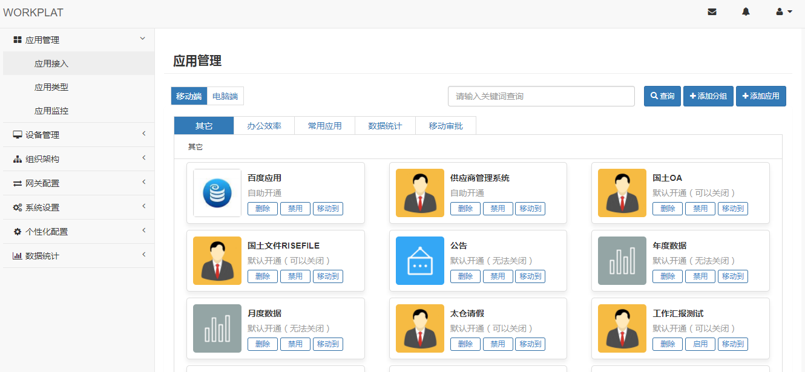
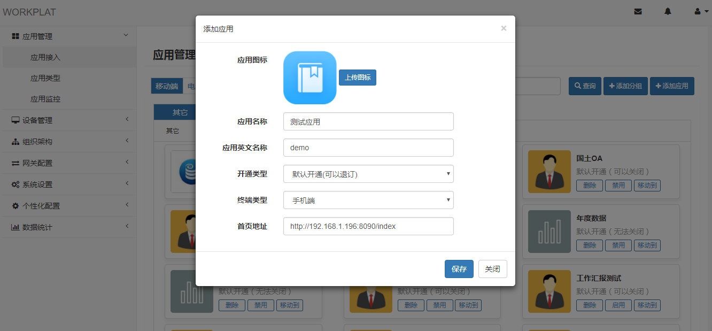
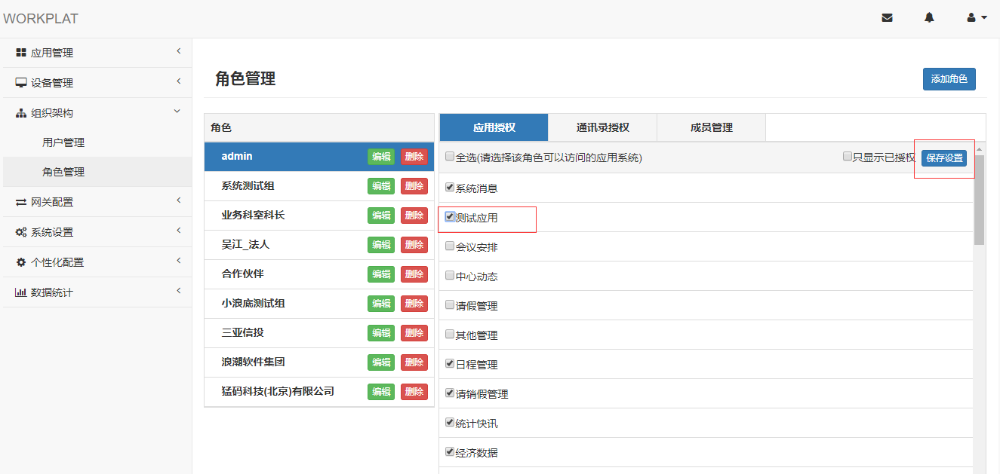
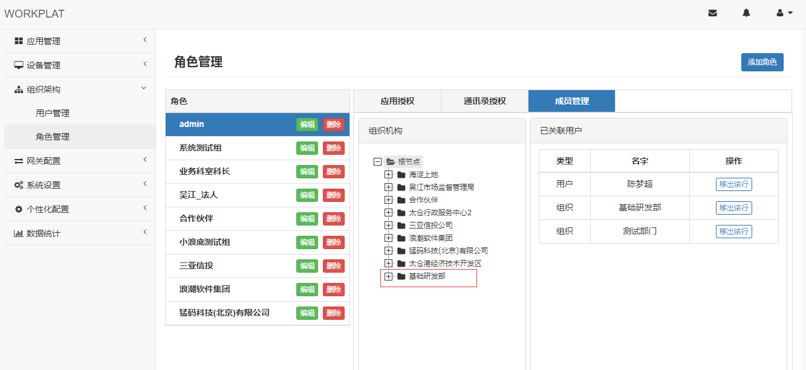
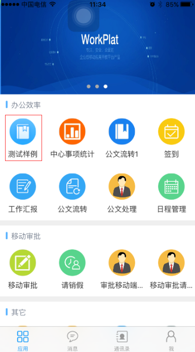

# Demo介绍
    此项目是workplat移动开放平台的接入样例，项目源码中提供了用户身份的对接与API网页接口的调用示例。

# 相关文档
[API接口文档.docx](https://github.com/yuxiaoyong/appdemo/blob/master/doc/API接口文档.docx?raw=true)<br>
[API网页接口.docx](https://github.com/yuxiaoyong/appdemo/blob/master/doc/API网页接口.docx?raw=true)<br>
[应用开发接入指南.docx](https://github.com/yuxiaoyong/appdemo/blob/master/doc/应用开发接入指南.docx?raw=true)<br>

# 项目打包、运行
``` lua
mvn clean package
java -jar appdemo-1.0-SNAPSHOT.war
```

访问地址：
http://localhost:8090/index


# 应用接入

表头 | 表头
-----|------
后台登录地址 | http://api.workplat.com:8080/wpapp-management/login/index
后台登录用户 | admin@taicang.gov.cn
后台登录密码 | 111111
IOS下载地址 | 
Android下载地址 | 
App登录用户 | 11111111111
App登录密码 | 111111

> 打开应用管理界面


> 打开添加应用界面

点击 "添加应用" 按钮，填写并保存应用基本信息


> 应用权限设置

勾选需要授权的应用，点击右上角的 "保存设置" 按钮，将应用访问权限授予某个角色


> 角色成员设置

点击 "成员管理" 选项卡，点击组织机构中的部门或用户，这些部门和用户将拥有角色的相关权限


> 打开移动App应用中心

打开移动App的应用中心，查看刚才接入的应用

