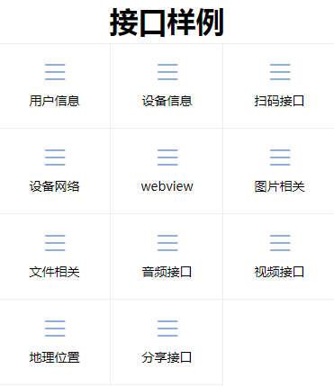

# 相关文档
[API接口文档.docx](https://github.com/yuxiaoyong/appdemo/blob/master/doc/API接口文档.docx?raw=true)<br>
[API网页接口.docx](https://github.com/yuxiaoyong/appdemo/blob/master/doc/API网页接口.docx?raw=true)<br>
[应用开发接入指南.docx](https://github.com/yuxiaoyong/appdemo/blob/master/doc/应用开发接入指南.docx?raw=true)<br>

# 项目打包、运行
``` lua
mvn clean package
java -jar appdemo-1.0-SNAPSHOT.war
```

访问地址：
http://localhost:8090/index


